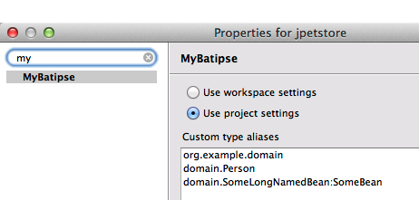

MyBatipse : Eclipse plugin for MyBatis
=======

[MyBatis](http://mybatis.org/) is a popular SQL Mapper framework.  
And __MyBatipse__ is an Eclipse plug-in which provids content assists and validations when editing MyBatis related files.

## Features

### XML Editor Enhancements
#### Auto-completion

- Mapper namespace : Calculated from the path.  

- Java class/Type alias : Propose Java classes and Type Aliases (translucent icons). Camelcase match is supported. [1] [2]  
 
- Java property : Propose properties of the parent java class. Nested properties are supported.  
 
- Statement ID : If corresponding mapper interface exists, propose the method name as a statement ID.  

- Reference to resultMap/select/sql : Propose ID of the referenced resultMap/select/sql. External reference is supported (blue icons).  

- Result elements in resultMap/collection/association : Generates <result /> elements for the parent java class properties.  
 

- __[1]__ For better performance, classes in the application libraries (loaded as JARs) are listed only when at least one package segment is specified.
- __[2]__ There is a limitation for the type alias support. Basically, if type aliases are registered using Java API, they are not automatically detected. As a workaround, you can register type aliases in MyBatipse's preference. See the _Configuration_ section.

#### Hyperlinks
- To referenced resultMap/select/sql element. External reference is supported.
- To mapper interface method.

#### Validation
- Missing TypeAlias, Java class/property.
- Missing resultMap/select/sql ID. 
- etc.   


### Java Editor Enhancements
- TODO

## Configuration

### MyBatis Nature
- By default, each file is validated when it's saved, but you would want to validate the XML mapper when the related Java classes are updated as well. For that purpose, MyBatipse provides a custom nature __MyBatis Nature__.  
To add the nature, right click the project in the package explorer and choose __Configure__ -> __Add MyBatis Nature__ from the menu.   


### Type Alias
- Type alias are automatically detected _if_ they are registered using XML config file (both mybatis and mybatis-spring config is supported).  
If you register type aliases in Java code, MyBatipse cannot detect them. As a workaround, you can register custom type aliases in the project setting (Open __Project__ -> __Properties__ menu and select __MyBatipse__ from the left column).  
   
For example, with the above settings: 
  - The first entry registers all the classes in ```com.example.domain``` package as type aliases.  
  - The second entry registers the single class ```domain.Person```.  
  - The third entry registers the single class ```domain.SomeLongNamedBean``` under the alias ```SomeBean```.
  - Note that, in any case, MyBatipse respects ```@Alias``` annotation if it exists.


## Installation

There are several ways to install MyBatipse.

- Drag this button [](http://marketplace.eclipse.org/marketplace-client-intro?mpc_install=1467819)  from browser to your Eclipse workbench (i.e. window).
- Choose __Eclipse Marketplace...__ in __Help__ menu of your Eclipse and search __MyBatipse__.
- Choose __Install New Software...__ in __Help__ menu and enter the following URL.  
http://dl.bintray.com/harawata/eclipse

## Bugs, questions, suggestions, etc.
Please use the [issue tracker](https://github.com/harawata/mybatipse/issues).  


## License
MyBatipse is licensed under [__Eclipse Public License 1.0__](http://www.eclipse.org/legal/epl-v10.html).
